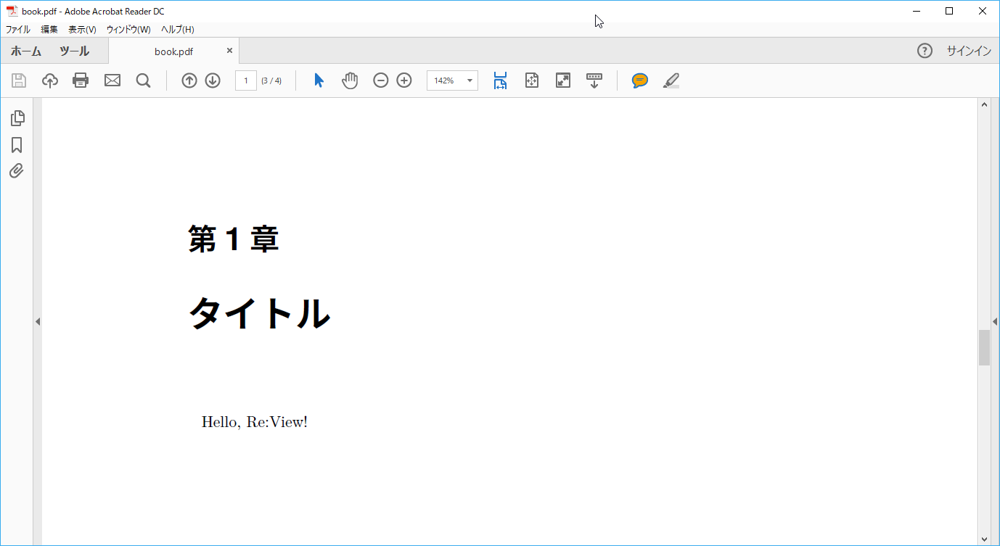

# docker-mdview

[](https://hub.docker.com/r/nuitsjp/mdview/)
[](https://hub.docker.com/r/nuitsjp/mdview/)
[](https://hub.docker.com/r/nuitsjp/mdview/)
[](https://hub.docker.com/r/nuitsjp/mdview/)

このリポジトリはMarkdownで記述した文書を、[Re:VIEW](https://github.com/kmuto/review/)を利用して書籍にビルドするためのコンテナを提供します。

[Re:VIEWのContainerイメージ](https://github.com/vvakame/docker-review)をベースに[md2review](https://github.com/takahashim/md2review)をインストールし、サポートのシェルスクリプトをいくつか用意した形です。

[DockerHub](https://hub.docker.com/r/nuitsjp/mdview/)に公開していますので、ご自由に利用ください。

## 仕様

### サポートしているタグ

Re:VIEWのバージョン毎にイメージを作成します。
現在存在しているタグは `latest`, `2.5` です。

```cmd
$ docker pull nuitsjp/mdview
$ docker pull nuitsjp/mdview:2.5
```

## 使い方

こちらにはWindowsのコンソールで実行する場合を記述します。それ以外の環境の場合、以下のドキュメントをご覧ください。

* [Windows Power Shell](doc/windows-powershell.md)
* [Mac or Linux](doc/mac-linux.md)

### 執筆環境を作成する

ドキュメントを執筆するにあたり、必要な設定ファイルなどを作製します。

```cmd
docker run --rm -v %cd%:/work nuitsjp/mdview "cd /work && mdview-init.sh document"
```

mdview-init.shの引数にdocumentを指定しているため、documentというサブディレクトリが作成され、その下に必要ファイルが配置されます。

ホストとゲストでフォルダの共有がうまく行かない場合は[こちら](http://www.nuits.jp/entry/docker-for-windows-share-drives)を参照。

### ドキュメントを記述する  

さきに作成したdocumentフォルダの中の「document.md」ファイルを開いて、次のように編集しましょう。

```txt
# タイトル

Hello, Re:View!
```


### PDFにビルドする

<span style="color: #d32f2f">カレントディレクトリをbookフォルダに移動後</span>、次のコマンドを実行しPDFにビルドします。

```cmd
docker run --rm -v %cd%:/work nuitsjp/mdview "cd /work && review-pdfmaker.sh config.yml"
```

実行が完了すると、次のようなPDFが作成されます。



複数のMarkdownファイルを記述して、catalog.ymdに取り込みたいmdファイルを定義することで、一つのPDFを複数のMarkdownから生成することもできますし、生成されるPDFの詳細はパラメーターを制御する事も可能です。

拡張子こそ異なりますが、その辺りはRe:VIEWの仕様に準じていますので、[Re:Viewのドキュメント](https://github.com/kmuto/review/wiki)もご覧ください。
