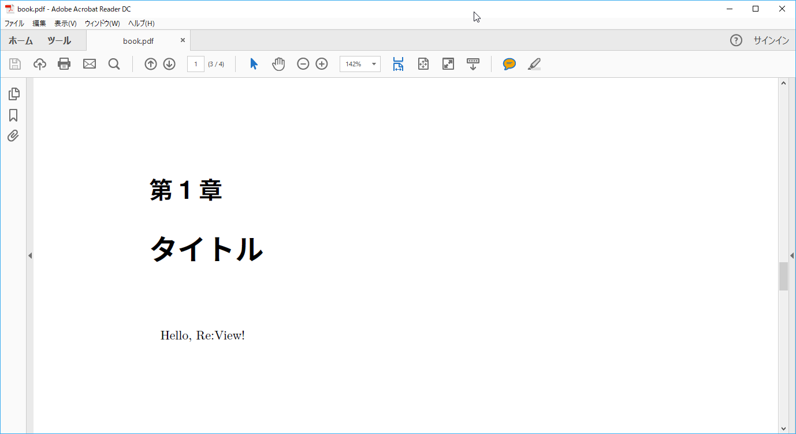

# WindowsでPower Shellを利用する場合

## 執筆環境を作成する

ドキュメントを執筆するにあたり、必要な設定ファイルなどを作製します。

```cmd
docker run --rm -v ${pwd}:/work nuitsjp/mdview /bin/sh -c "cd /work && mdview-init.sh book"
```

mdview-init.shの引数にbookを指定しているため、bookというサブディレクトリが作成され、その下に必要ファイルが配置されます。

ホストとゲストでフォルダの共有がうまく行かない場合は[こちら](http://www.nuits.jp/entry/docker-for-windows-share-drives)を参照。

## ドキュメントを記述する  

さきに作成したbookフォルダの中の「book.md」ファイルを開いて、次のように編集しましょう。

```txt
# タイトル

Hello, Re:View!
```

## PDFにビルドする

<span style="color: #d32f2f">カレントディレクトリをbookフォルダに移動後</span>、次のコマンドを実行しPDFにビルドします。

```cmd
docker run --rm -v ${pwd}:/work nuitsjp/mdview /bin/sh -c "cd /work && review-pdfmaker.sh config.yml"
```



複数のMarkdownファイルを記述して、catalog.ymdに取り込みたいmdファイルを定義することで、一つのPDFを複数のMarkdownから生成することもできますし、生成されるPDFの詳細はパラメーターを制御する事も可能です。

拡張子こそ異なりますが、その辺りはRe:VIEWの仕様に準じていますので、[Re:Viewのドキュメント](https://github.com/kmuto/review/wiki)もご覧ください。
